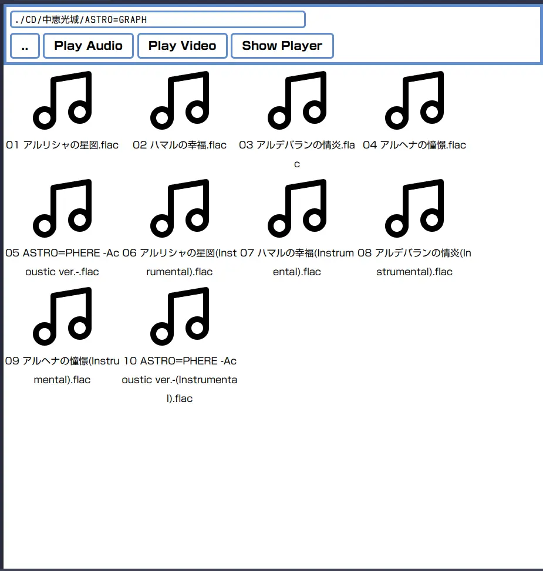
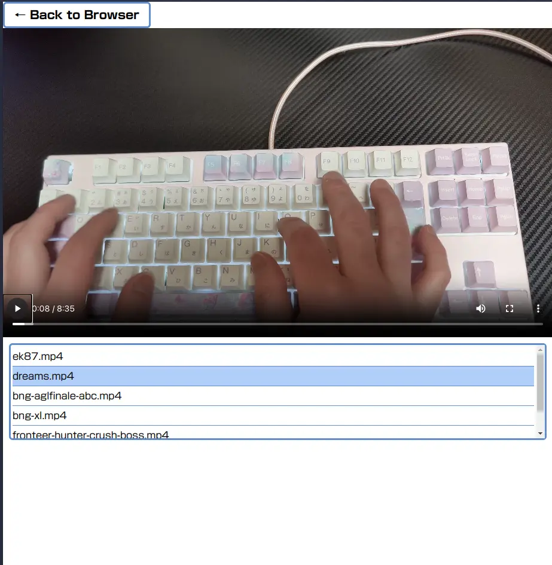

# Local Web Media Player

## Synopsis

Play video and music with WebUI from other device on local network.

## Description

The software consists of a Ruby/CGI script to return file lists and a SPA front end written in Vanilla JavaScript.

The web server functionality relies on lighttpd.

Frontend provides file browser view and video/audio player view.

The File Browser view displays only directories, audio files, and video files.
Clicking on a media file will start playback of that file.
If you click on a folder, it advances to that folder.

`..` to go one folder up.

Click `Play Audio` to put all audio files in this folder into a playlist.

Clicking `Play Video` will put all video files in this folder into a playlist.

Click `Show Player` to switch to the Player view.

Player view has a playlist.
If an item remains in the playlist, it will automatically start playing the next item when playback ends.

Clicking on an item in the playlist starts playback of that item.

This software supports `.m3u` playlist *only* has relative path.

## Caution

This software is intended to be used to play media from other devices within a LAN.
It is not intended to be published on the Internet and such activities are dangerous and should be avoided.

## Requiement

* lighttpd
* Ruby >= 3.2
* OS uses UTF-8 based filename

## Install

* Clone this repository to your local.

## Configuration

Copy `sample/lighttpd.conf` and edit it.

* `server.username` to your user name.
* `server.groupname` to your user group name.
* `server.document-root` to path to localwebmediaplayer repository + `/src`
* `server.port` to publish port you wish (optional)
* `cgi.assign` to your `ruby` path

## Usage

* Start server with `MEDIA_ROOT="</path/to/your/media/library/root>/" REPOSRC="</path/to/repository>/src" lighttpd -D -f <path/to/config/file>`
* Access started server with web browser

See `sample/lwmp.bash`.

`MEDIA_ROOT` needs `/` at the end.

# Resources Used

This project includes the following external icon set:

Feather Icons A clean and elegant SVG icon library <https://feathericons.com/> © 2013–2023 Cole Bemis — Licensed under the MIT License

Icon files are located in the `src/img` directory. The corresponding Feather Icons license file is included in that directory.

