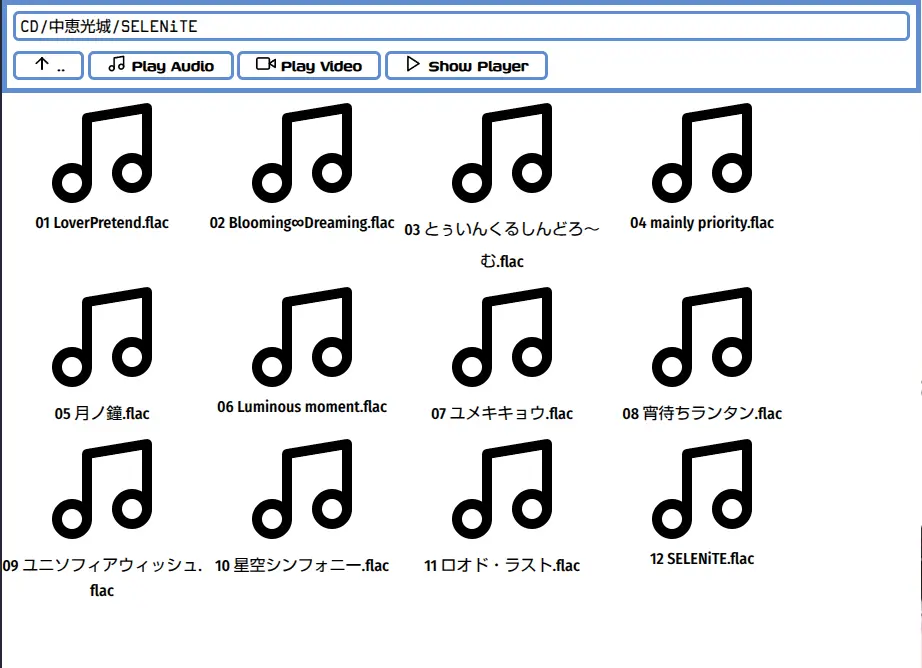
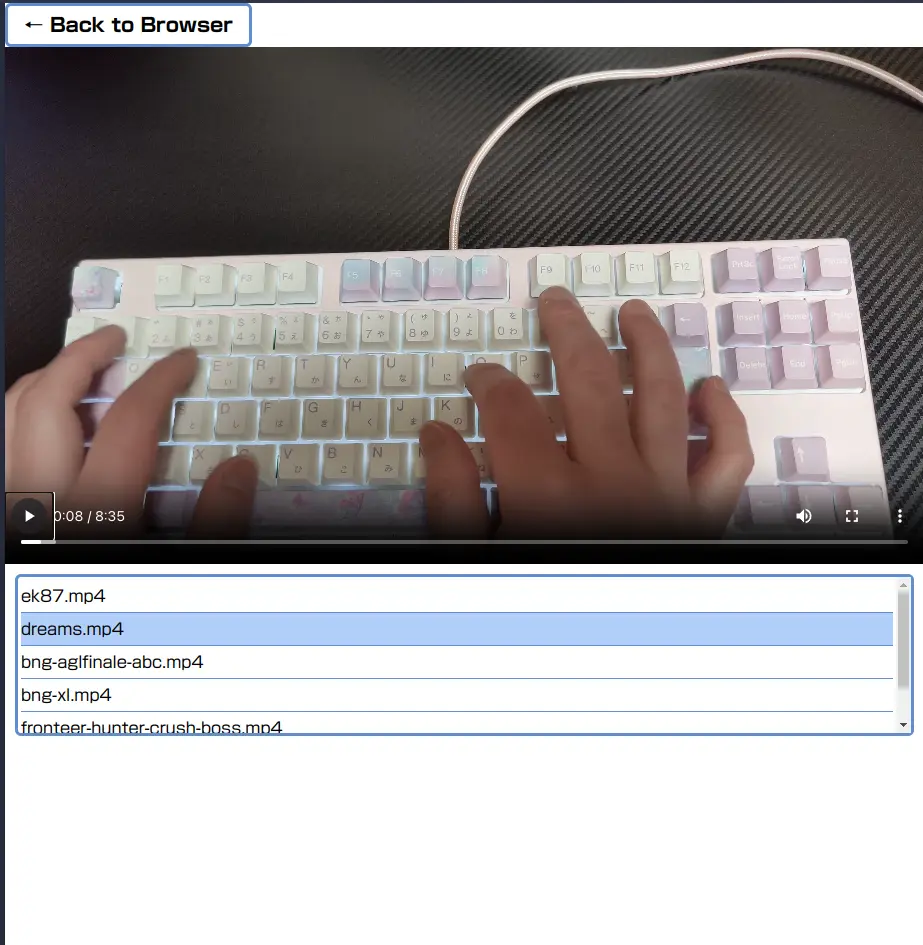

# Local Web Media Player

## Synopsis

Play video and music with WebUI from other device on local network.

## Description

The software consists of a Ruby/CGI script to return file lists and a SPA front end written in Vanilla JavaScript.

The web server functionality relies on lighttpd.



Frontend provides file browser view and video/audio player view.

The File Browser view displays only directories, audio files, and video files.
Clicking on a media file will start playback of that file.
If you click on a folder, it advances to that folder.

`..` to go one folder up.

Click `Play Audio` to put all audio files in this folder into a playlist.

Clicking `Play Video` will put all video files in this folder into a playlist.

Click `Show Player` to switch to the Player view.



Player view has a playlist.
If an item remains in the playlist, it will automatically start playing the next item when playback ends.

Clicking on an item in the playlist starts playback of that item.

This software supports `.m3u` playlist *only* has relative path.

💡hint: Player supports nexttrack/previoustrack key.


Clicking an image file opens the image viewer.

The viewer is divided into three zones: left, center, and right.

* Clicking the left zone shows the previous image
* Clicking the right zone shows the next image
* Clicking the center zone closes the viewer

These zones are applied to the entire viewport of the image viewer, not to the image itself.


Clicking the `Book Reader` button opens a viewer that displays all images within the current folder.

Pages are sorted in lexicographical order based on file names and cannot be rearranged.

The book reader is displayed in full-viewport mode, divided vertically with a 1:2 ratio:

* The upper section reveals reader options when clicked:
    * Toggle between single and spread (two-page) view
    * Switch page-turn direction (left-to-right or right-to-left)
    * Jump to a specific page

The lower section is split into five horizontal zones:

* Clicking the center zone closes the reader
* Clicking the left or right zones turns pages:
    * Near the center: turns 1 page
    * Near the edges: turns 2 pages
    * Note: If only 1 image is displayed, the 2-page action will result in a single page turn

Book Reader Keyboard Operation:

|Key|Turns|
|-----|-------------------|
|←|Left 2 pages|
|→|Right 2 pages|
|↓|Forward 2 pages|
|↑|Back 2 pages|
|PageDown|Forward 1 page|
|PageUp|Back 1 page|

## Caution

This software is intended to be used to play media from other devices within a LAN.
It is not intended to be published on the Internet and such activities are dangerous and should be avoided.

## Requiement

* lighttpd
* Ruby >= 3.2
* OS uses UTF-8 based filename

## Install

* Clone this repository to your local.

## Configuration

The configuration file should be placed at `${XDG_CONFIG_HOME:-$HOME/.config}/reasonset/lwmp.yaml`.  
A sample configuration file is available at `sample/lwmp.yaml`, which you can copy and customize.

There are two global settings: `repo` and `lighttpd_cmd`.  
If you use `tools/script/lwmp-start.rb` in its default location, `repo` can be omitted.  
In most cases, `lighttpd_cmd` does not need to be specified. You only need to set this if the Lighttpd command name is different or if it's not in your system's PATH.

Individual instance settings should be written under the `profiles` section.  
Each key in `profiles` represents a profile name, which is used at startup.  
You must specify both the directory to browse (`media`) and the server port (`port`).

## Usage

```
lwmp-start.rb <profile_name>
```

You can start a Lighttpd instance using `tools/script/lwmp-start.rb`.  
Use the `profile_name` specified as a key in the `profiles` section of the configuration file.

You may also copy this script to a directory included in your system’s PATH for convenience.  
In that case, make sure to specify the `repo` setting in the configuration file.

# Windows Support

To run this on Windows, you’ll need [WSL (Windows Subsystem for Linux)](https://learn.microsoft.com/en-us/windows/wsl/).  
If you're not already using WSL, we recommend [WSL 2](https://learn.microsoft.com/en-us/windows/wsl/install) for better compatibility and performance.

Once WSL is set up and a Linux distribution is installed, you can use the tool as described above.  
Make sure your configuration file and script paths are accessible from within your WSL environment.

## Setting Up on Windows with WSL

Which allows you to run Linux distributions directly inside Windows.

As an example, here’s how to set up the environment using the official Arch Linux image:

```powershell
wsl --install archlinux
```

After launching Arch Linux for the first time, update the system:

```bash
sudo pacman -Syu
```

Then, install the required packages:

```bash
sudo pacman -S ruby lighttpd
```

Prepare the project directory and configuration folder:

```bash
mkdir -p ~/.local/opt
cd ~/.local/opt
git clone https://github.com/reasonset/localwebmediaplayer.git
cd
mkdir -p ~/.config/reasonset
```

Once this setup is complete, you're ready to configure and start the server using the provided script.  
Make sure your configuration file (`lwmp.yaml`) is placed under `~/.config/reasonset/`.

## Prepare media folders

### How to Specify Media for Distribution (For Windows Users)

To distribute folders (like music or videos) with LWMP, they must be accessible from your WSL instance.

#### How WSL Can See Windows Folders

In WSL, your Windows folders are mounted under `/mnt/`.

| Location on Windows                | Path in WSL                           |
|-----------------------------------|--------------------------------------|
| `C:\Users\username\Music`         | `/mnt/c/Users/username/Music`        |
| `D:\Videos`                       | `/mnt/d/Videos`                      |

#### Grouping Multiple Folders into One Directory

If you'd like to distribute several folders at once, you can use symbolic links to combine them inside a single directory in WSL:

```bash
mkdir ~/media
ln -s /mnt/c/Users/<username>/Music ~/media/Music
ln -s /mnt/c/Users/<username>/Videos ~/media/Videos
```

Now you can specify `~/media` as your LWMP source directory, and both Music and Videos will be available.

## Editing the Configuration File (`lwmp.yaml`)

If you're using WSL on Windows, it's recommended to edit the configuration file using a text editor you're familiar with.

You can either:

* Use a graphical editor on Windows by accessing the WSL file system via the path:  
  `\\wsl.localhost\<DistroName>\home\<username>\.config\reasonset\lwmp.yaml`  
  (Note: `<DistroName>` is typically something like `Arch`, `Ubuntu`, etc.)
* Or, use a basic editor inside WSL, such as `nano`, which is easier for beginners than `vim`:  
  ```bash
  sudo pacman -S nano   # If nano is not installed
  nano ~/.config/reasonset/lwmp.yaml
  ```

Choose whichever method you find more comfortable. Just make sure to save the changes correctly before starting the server.

## Start server

### Start the LWMP Server

Now that everything is set up, you can start the LWMP server using the following command:

```bash
~/.local/opt/localwebmediaplayer/tools/script/lwmp-start.rb <profile_name>
```

If you find this command too long, there are two main ways to simplify it:

#### Option 1: Use an alias

You can define an alias in your `.bashrc` file like this:

```bash
alias lwmp-start="$HOME/.local/opt/localwebmediaplayer/tools/script/lwmp-start.rb"
```

This allows you to run the server simply by typing:

```bash
lwmp-start <profile_name>
```

This is the recommended method as it's easy to manage and update.

#### Option 2: Copy the script to a directory in your PATH

```bash
sudo cp ~/.local/opt/localwebmediaplayer/tools/script/lwmp-start.rb /usr/local/bin/
```

After this, you can start the server using:

```bash
lwmp-start.rb <profile_name>
```

**Note:** If you update the script later, you'll need to copy it again to `/usr/local/bin/`.

# Resources Used

This project includes the following external icon set:

Feather Icons A clean and elegant SVG icon library <https://feathericons.com/> © 2013–2023 Cole Bemis — Licensed under the MIT License

Icon files are located in the `src/img` directory. The corresponding Feather Icons license file is included in that directory.

# Other softwares

* `httpclient.mjs` from [fetchwrapper](https://github.com/reasonset/fetchwrapper) ([Apache License 2.0](https://github.com/reasonset/fetchwrapper/blob/master/LICENSE))

